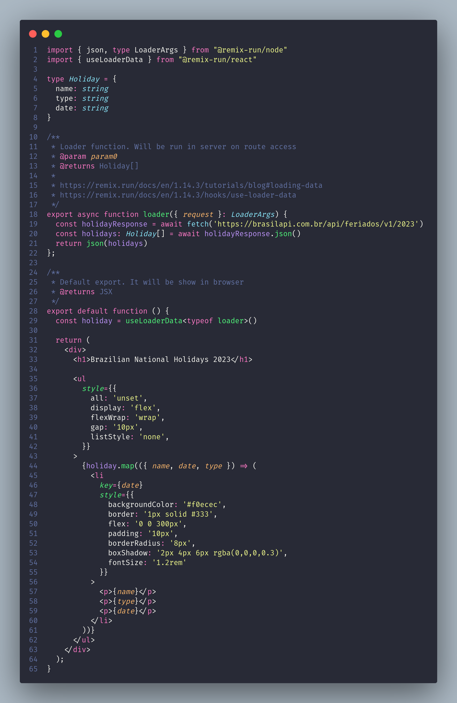

# Access external APIs

## Este projeto tem como objetivo exemplificar a chamada de APIs externas e sua utilização no Remix

### 1 - Criar o arquivo **"feriados.tsx"** na pasta **"app/routes"** do projeto

- Criamos a função **"loader"** que será executada sempre que a rota **"/feriados"** for acessada (linha 18)
- Na implementação da função, foi realizada uma chamada a uma API externa utilizando o "fetch" (poderia utilizar outra forma Ex: Axios) (linha 19)
- Com o retorno da API a função retorna um JSON utilizando a função **"json"** do Remix. (linha 21)
- Já na função exportada como default, que será renderizada pelo browser, utilizamos o hook **"useLoaderData"** que nos permite pegar os valores retornados do servidor pela função **"loader"** no client (linha 29) [exemplo](https://remix.run/docs/en/1.14.3/tutorials/blog#loading-data) / [documentação](https://remix.run/docs/en/1.14.3/hooks/use-loader-data)
- O restante da implementação é um JSX que itera sobre os elementos retornados pela API
