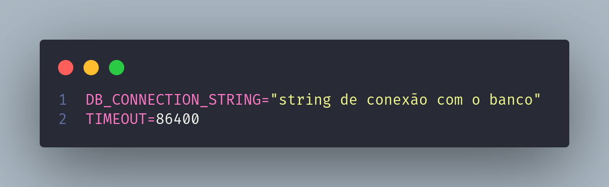
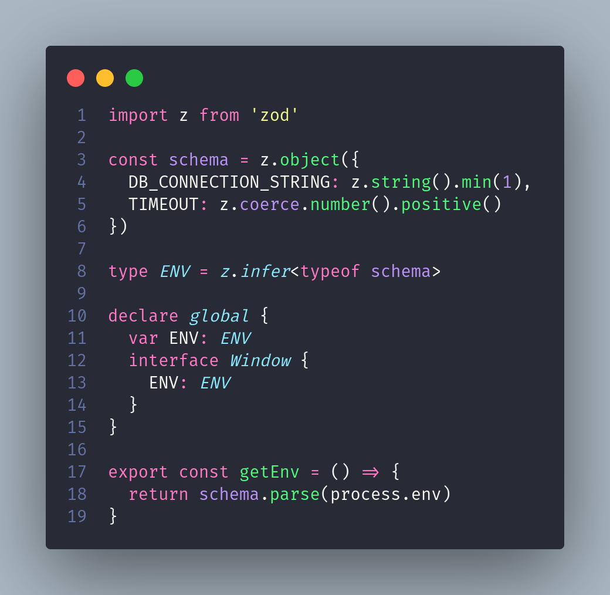
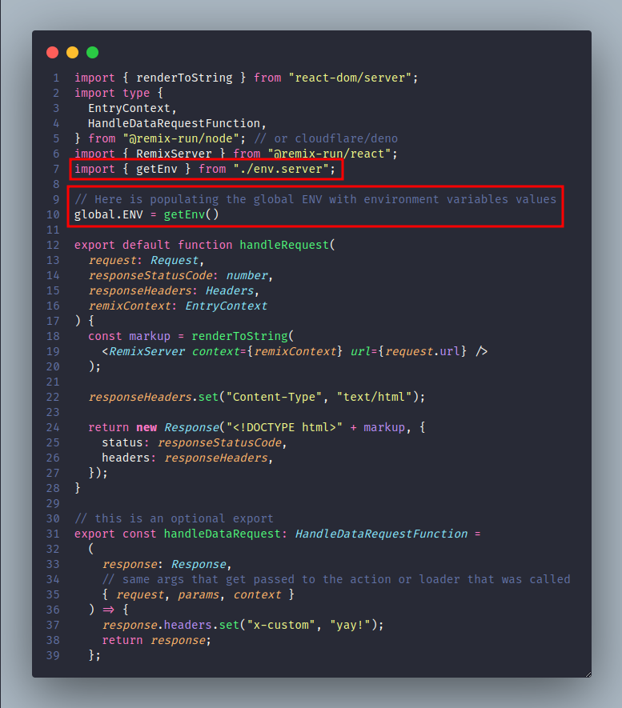
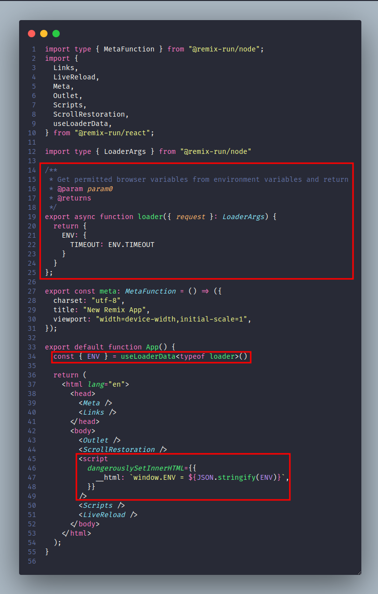
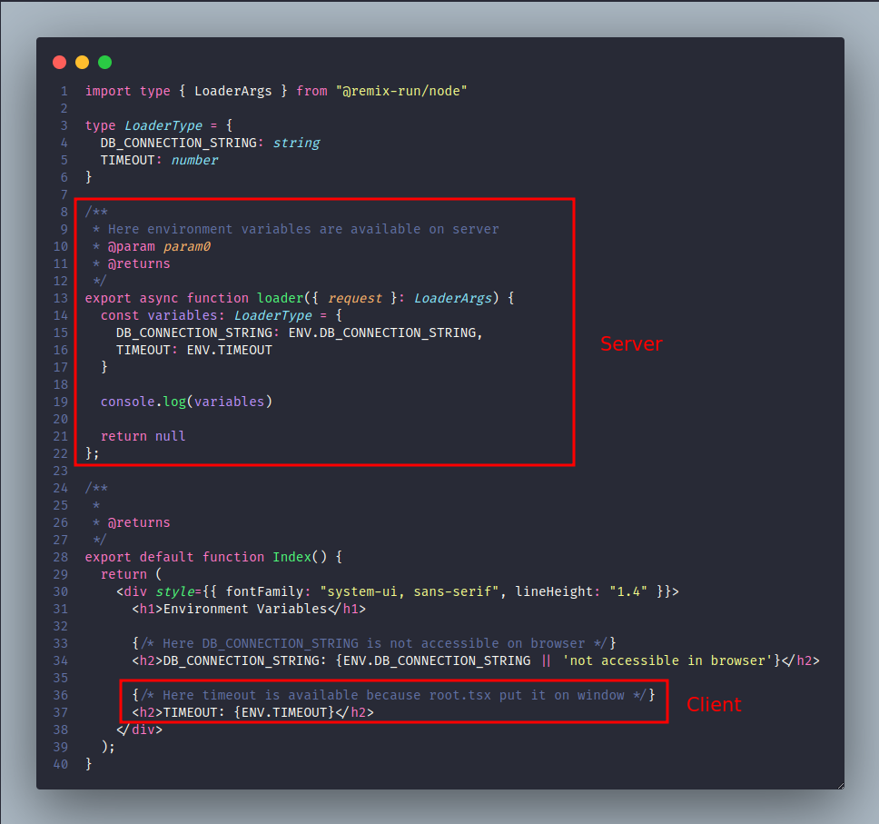

# Environment Variables

## Este projeto tem como objetivo exemplificar a utilização de variárvies de ambiente no Remix

### 1 - Criar o arquivo **".env"** na raiz do projeto



### 2 - Instalar a lib **"Zod"** que auxiliará na validação das variáveis

```sh
npm i zod
```

### 3 - Criar o arquivo **"env.server.ts"** na pasta "app"



### 4 - Caso a aplicação não tenha, criar o arquivo **"entry.server.tsx"** na pasta **"app"** conforme a [documentação](https://remix.run/docs/en/1.14.3/file-conventions/entry.server)



#### Utilizar a função **"getEnv"** criada no arquivo **"env.server.ts"** atribuindo seu retorno a **"global.ENV"** conforme o exemplo acima.

### 4 - Expor as variáveis que necessitam de acesso no Client (Browser)



#### 5 - Agora podemos utilizar as variáveis de ambiente no servidor e as que foram expostas ao cliente no browser conforme o exemplo abaixo:


