# Utilização de Banco de Dados

## Este projeto tem o objetivo de mostrar como seria a utilização de Banco de Dados com o Remix.

### Será utilizado o banco de dados "SQLite" e a biblioteca ORM Prisma

### 1 - Inicializar o prisma no projeto

```sh
npx prisma init
```

Após finalizar o processamento do comando acima, a pasta "prisma" e o arquivo ".env" são criados na raiz do projeto

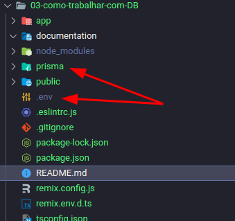

### 2 - Editar o arquivo **".env"** trocando a string de conexão gerada pelo prisma

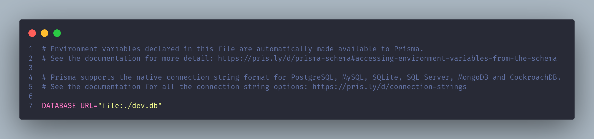

Esta url diz ao prisma para criar o arquivo "deb.db" dentro da pasta "prisma"

### 3 - Schema do Prisma

Ajustar o arquivo "schema.prisma" da pasta "prisma" informando o provedor do banco de dados como "sqlite":

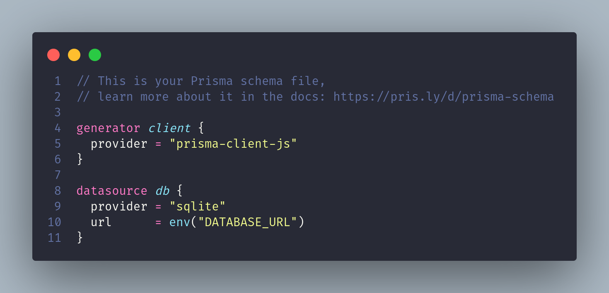

### 4 - Criar o modelo da tabela que represente os dados de um usuário

Criar o model **User** conforme exemplo abaixo ([documentação](https://www.prisma.io/docs/concepts/components/prisma-schema/data-model))
Instale esse [plugin](https://marketplace.visualstudio.com/items?itemName=Prisma.prisma) no VSCode que ele auxilia na escrita dos modelos do Prisma

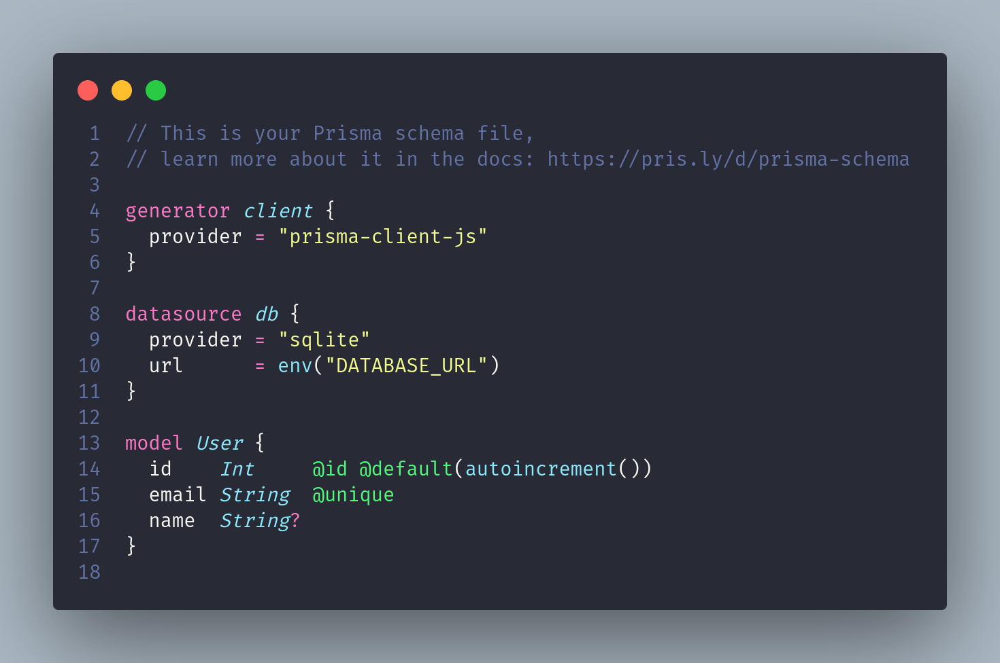

Em seguida rodamos o comando:

```sh
npx prisma db push
```

Ao executar o comando um arquivo "dev.db" será criado na pasta "prisma" e o prisma instala todas as dependências necessárias

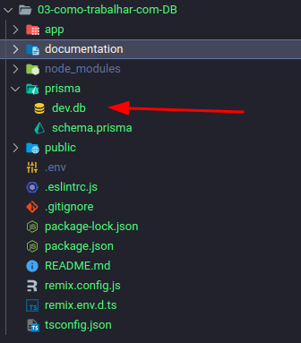

Agora com o banco criado, podemos acessar as tabelas e dados utilizando o Prisma Studio

```sh
npx prisma studio
```

Utilizando o browser, vamos acessar http://localhost:5555. Com a interface exibida, podemos inserir alguns registros na nossa tabela User

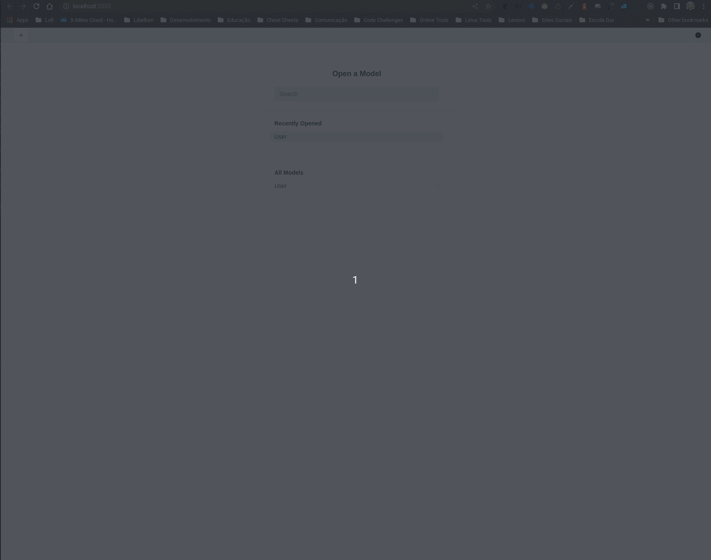

### 5 - Com o banco de dados e populado minimamente, vamos agora exibir os dados em um rota Remix

- Criar o arquivo "de.server.ts" para realizar a criação do PrismaClient que será utilizado pelas rotas para acessar os dados do banco

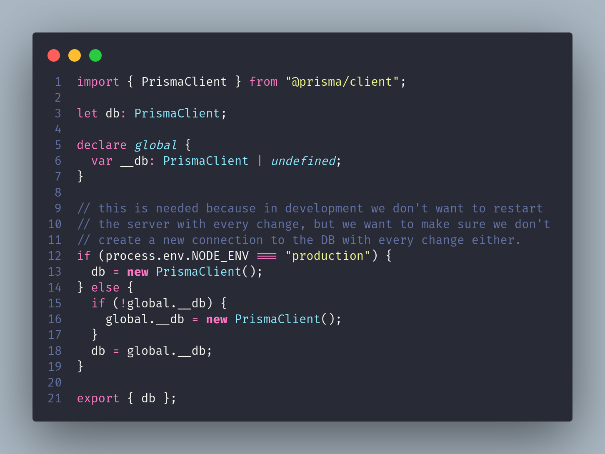

- Ajustar o arquivo **"app/routes/index.tsx"**

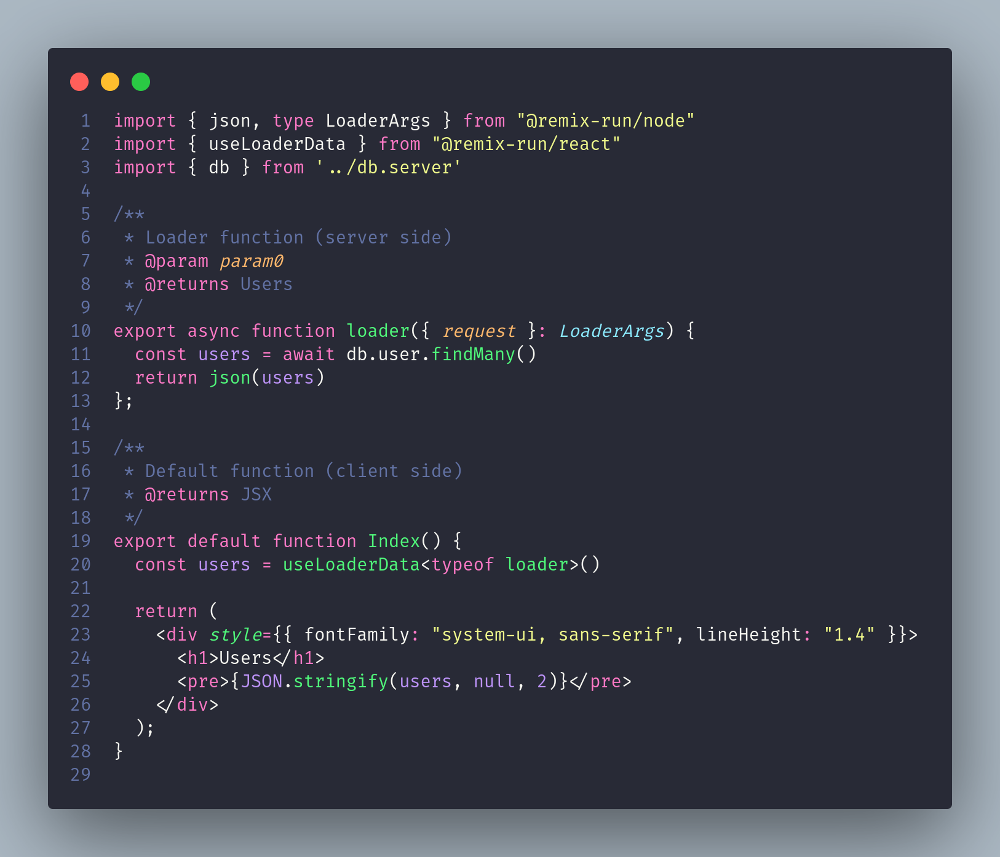

o resultado:

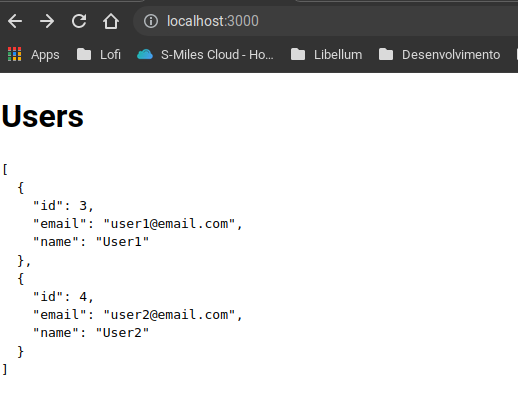

### 6 - Criando processo de Seed (carregamento de dados utilizando o Prisma)

- Vamos instalar as seguintes libs:

```sh
 npm i -D @faker-js/faker ts-node
```

- Criar o arquivo **"prisma/seed.ts"**

  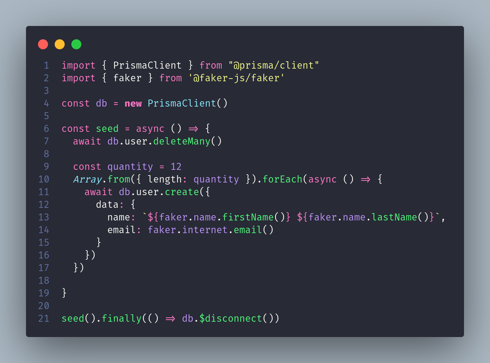

- Adicionar scripts no **package.json** para rodar o seed

  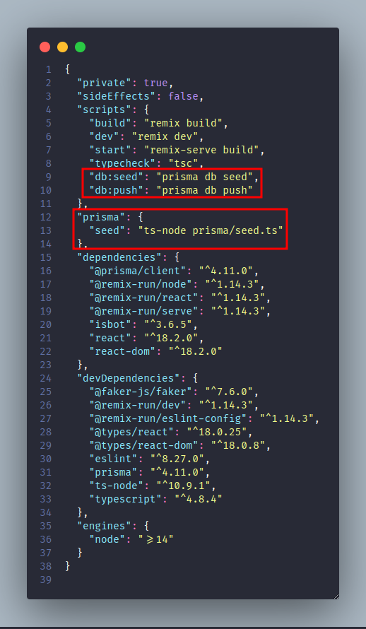

- Rodar o comando abaixo para popular a tabela **User**

  ```sh
  npm run db:seed
  ```

  e o resultado

  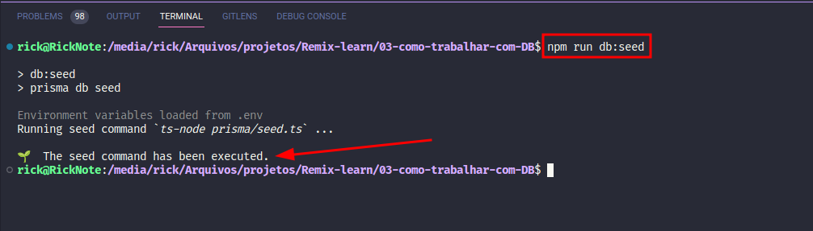

### 7 - Adicionando novas colunas na tabela **User**

- Ajustar o arquivo **"prisma/schema.prisma"** adicionando as novas colunas

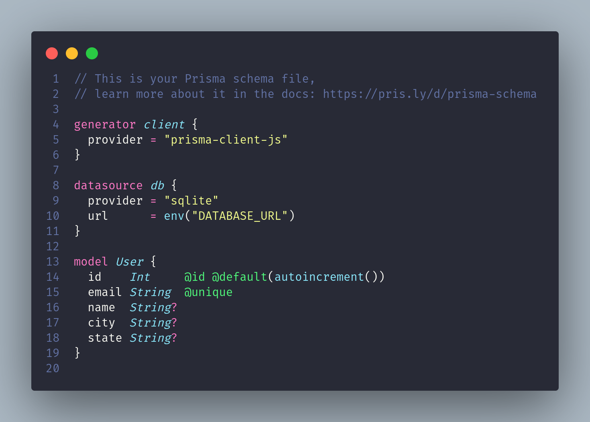

- Rodamos o comando para atualizar a estrutura do banco

```sh
npx prisma db push
```

Após rodar o comando acima, caso o Prisma Studio esteja rodando, pare e inicie novamente para pegar as alterações.

Agora vamos ajustar o arquivo de seeds, adicionando as novas colunas

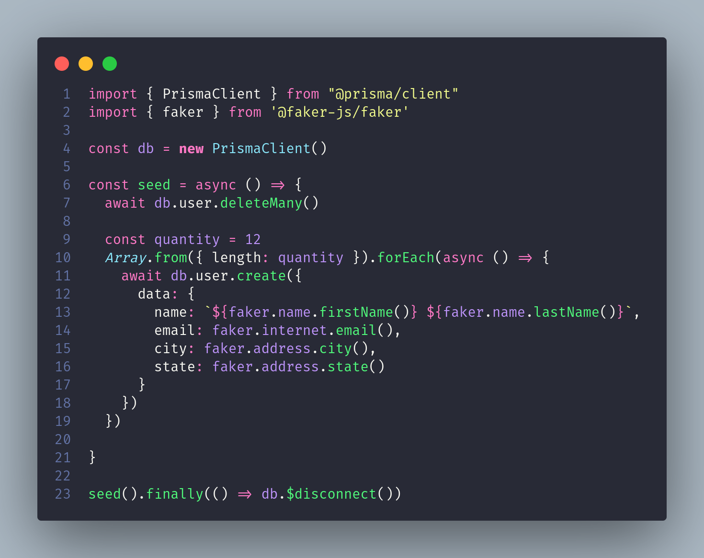

- Rodar o comando abaixo para popular a tabela **User** agora com os novos campos

  ```sh
  npm run db:seed
  ```
