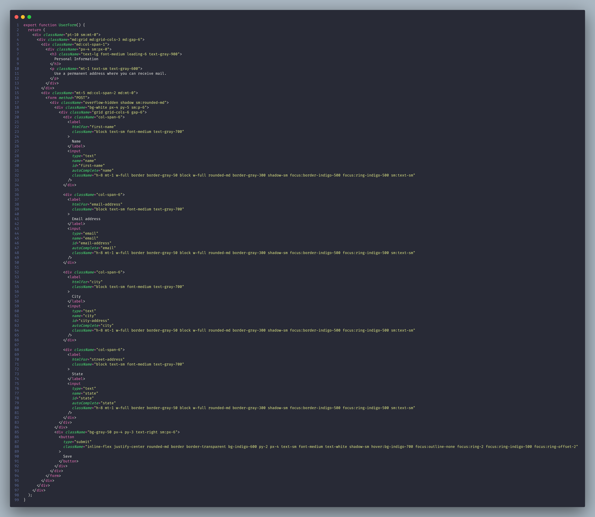

# Capturar input do usuário para gravar na base de dados

## Este projeto tem o objetivo de mostrar como é o processo de capturar o input do usuário e gravar os dados no banco de dados

## Será utilizado o banco de dados "SQLite" e a biblioteca ORM Prisma

## 1 - Adicionar o Tailwind

- ### Vamos adicionar o Tailwind no projeto da maneira mais simples que é inserindo um script da lib apontando para o "Play CDN"

- ### Para isso vamos ajustar o arquivo **"app/root.tsx"**

- 

## 2 - Criar componente de Tabela de Usuários

- ### Vamos criar o arquivo **"app/components/UsersTable.tsx"**

- 

## 3 - Refatorar a rota da listagem

- ### Renomear o arquivo **"app/routes/index.tsx"** para **"app/routes/users.tsx"** que utilizará o componente **"UsersTable"**

- 

- ### Criar o arquivo **"app/routes/index.tsx"** que somente fará o redirecionamento para a rota **"/users"**

- 

## 4 - Criar componente de Formulário de Usuário

- ### Vamos criar o arquivo **"app/components/UsersForm.tsx"**

- 

## 5 - Nested Routes (rotas aninhadas)

- ### Criar a pasta **"app/routes/users"**
- ### Criar o arquivo **"app/routes/users/form.tsx"**

- 

- ### Essa rota será uma rota filha da roda "/users", e sempre que for acionada a rota "/users/form" ela será carregada como filha da rota "/users" no local onde foi usado o componente **"Outlet"** dentro do componente **"UsersTable"**

- ### Sempre que o formulário contido no componente **"UsersForm"** for enviado (submit), a função **"action"** do arquivo **"app/routes/users/form.tsx"** será acionada recebendo os dados enviados que por sua vez envia os dados para o banco de dados utilizando o Prisma e em seguida redireciona para a rota **"/users"**

- ### Podemos perceber também que temos exportado nesse arquivo uma função **"ErrorBoundary"** que é responsável por tratar qualquer erro que ocorrer nessa rota (/users/form)
