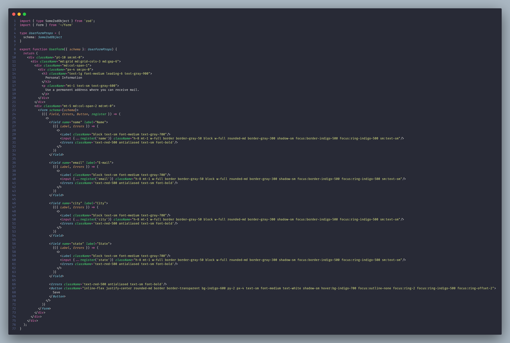

# Capturar input do usuário para gravar na base de dados utilizando o Remix-forms

## Este projeto tem o objetivo de mostrar como é o processo de capturar o input do usuário e gravar os dados no banco de dados

## Será utilizado o banco de dados "SQLite" e a biblioteca ORM Prisma

## 1 - Instalar as libs necessárias para utilizar o [remix-forms](https://remix-forms.seasoned.cc/get-started)

```sh
npm install remix-forms domain-functions zod react-hook-form
```

- ### Seguindo todos os passos da [documentação](https://remix-forms.seasoned.cc/get-started) do remix-forms vamos instalar e configurar a lib no projeto

- ### Criar o arquivo **"app/form-action.server.ts"**


- ### Criar o arquivo **"app/form.ts"**


- ### Ajustar o arquivo **"app/routes/users/form.tsx"**
- Nesse ajuste criamos:
  - O Schema de validação do form utilizando o ZOD
  - A função de mutatio que receberá os dados do formulário em caso estar válido
  - A action que receberá o post do formulário e envia os dados para a mutation em caso de formulário válido
  - Passamos uma propriedade **"schema"** para o componente **"UserForm"**


- ### Ajustar o componente **"UserForm"**
- Nesse ajuste:
  - Criamos um type para definir as propriedades do componente
  - Importamos o "Form" criado (segundo a documentação do remix-forms)
  - Colocamos os campos do formulário (segundo a [documentação](https://shre.ink/kAmN) do remix-forms) e removemos o formulário standard do HTML


