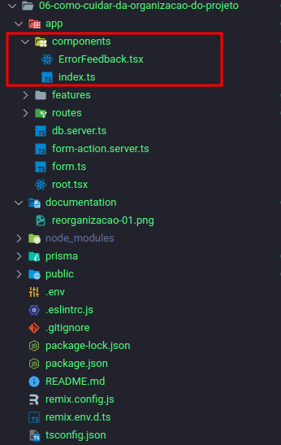
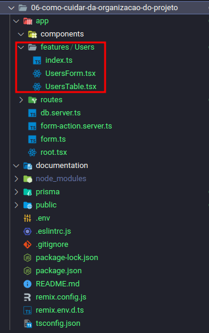
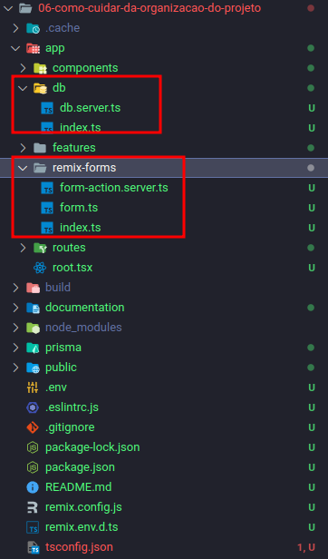

# Organização do Projeto

## Este projeto tem o objetivo de mostrar como pode ser feita a organização de um projeto Remix

## Pegaremos o projeto "05-como-salvar-input-usuario-complexo" como base para reorganizar o projeto

## 1 - Pasta **"components"**

- ### Utilizada para componentes mais genéricos que podem ser utilizados em diversas features.

  - ### Ex: Botão, Input e etc

    

## 2 - Pasta **features**

- ### Utilizada para componentes e outros arquivos que são diretamente ligados a uma funcionalidade da aplicação.

  - ### Ex: UsersForm, UsersTable e etc

    

  - ### Nesse caso aqui também podemos criar o arquivo **"users.api.ts"** que centralizará todo acesso ao banco de dados com a utilização do prisma, evitando que os componentes de feature **UsersForm** e **UsersForm** conheçam o **Prisma**

## 3 Na pasta **"app"** procurar deixar somente os arquivos do Remix que seriam **"root"**, **"entry.server"** e **"entry.client"** (esses últimos se houver). Para isso vamos criar as seguintes pastas:

- ### **"db"** que terá as configurações do Prisma
- ### **"remix-forms"** que terá as configurações do remix-forms.

  
