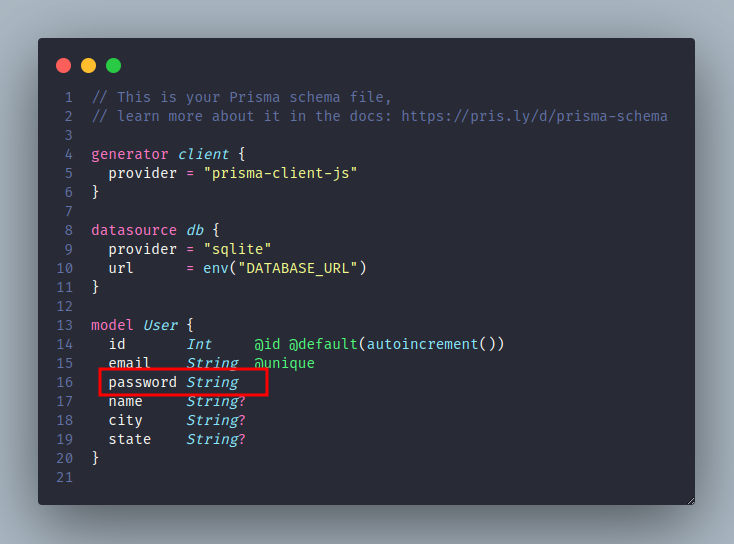
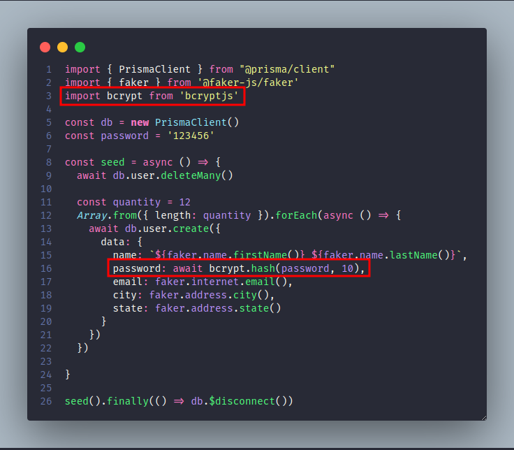

# Autenticação e conteúdo protegido

## Este projeto tem o objetivo de mostrar como realizar autenticação e permitir acesso a conteúdos somente se estiver autenticado

## Pegaremos o projeto "06-como-cuidar-da-organizacao-do-projeto" como base para nossa implementação

## 1 - Adicionar uma nova coluna na tabela **"User"**



## 2 - Rodar o comando para alterar o banco de dados

### Como a nova coluna que estamos inserindo não é opcional, o prisma vai dar uma mensagem informando que se ele continuar toda a tabela será removida e criada novamente do zero.

```sh
  npm run db:push
```

## 3 - Vamos instalar uma lib para realizar a criptografia das senhas

```sh
  npm i bcrypt
  npm i -D @types/bcrypt
```

## 4 - Agora vamos ajustar o arquivo **"prisma/seed.ts"** para inserir o novo campo "password" definindo uma senha padrão.



### Agora vamos rodar o arquivo **"seed.ts"** para gerar os novos dados em nossa tabela

```sh
  npm db:seed
```
