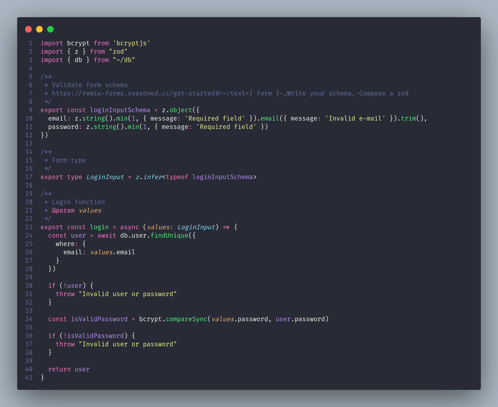
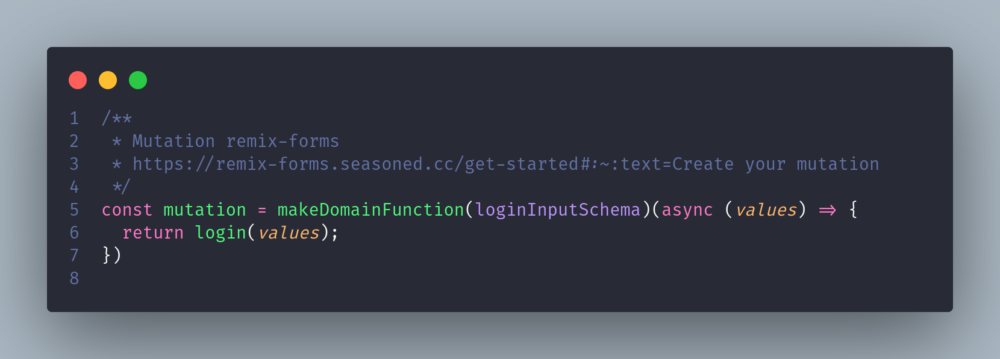
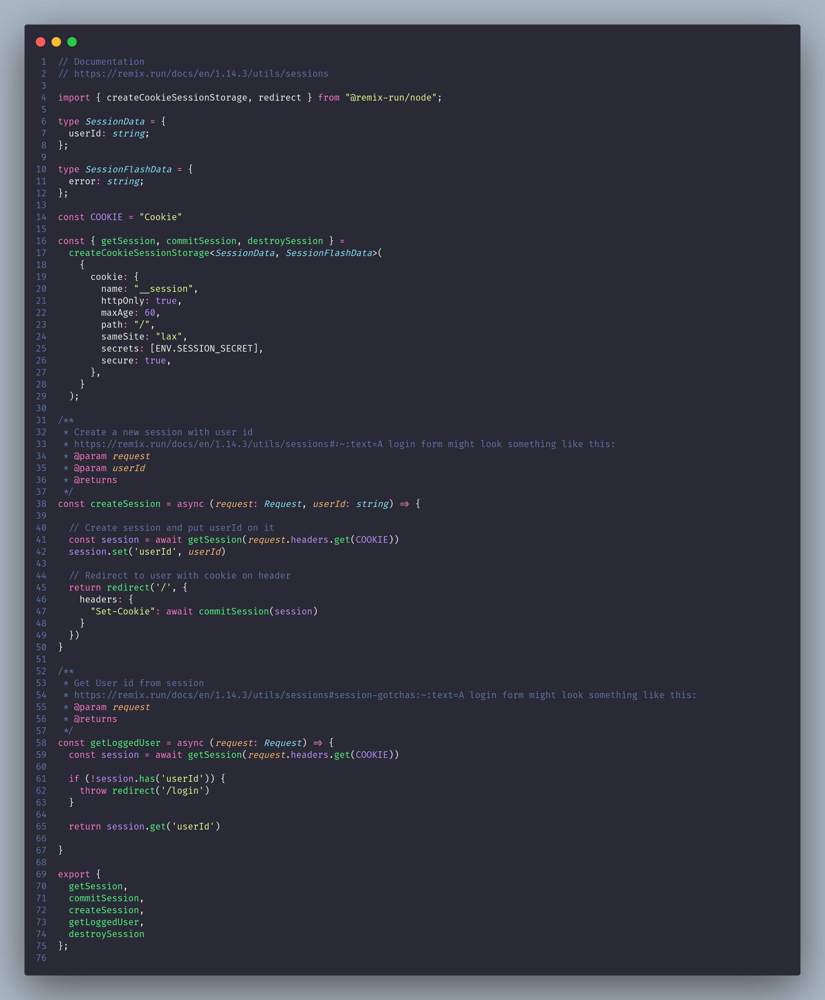
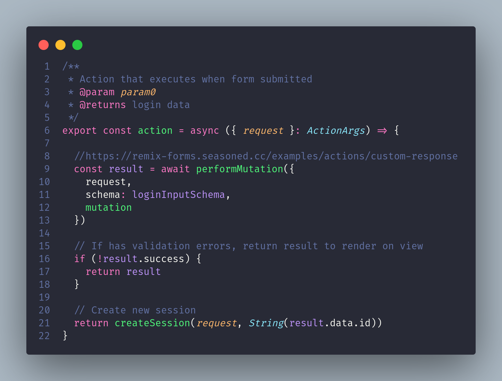
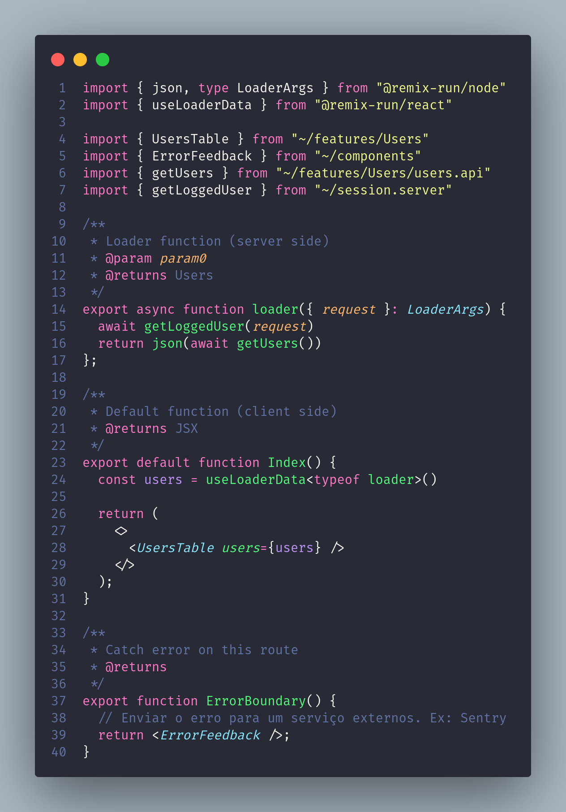
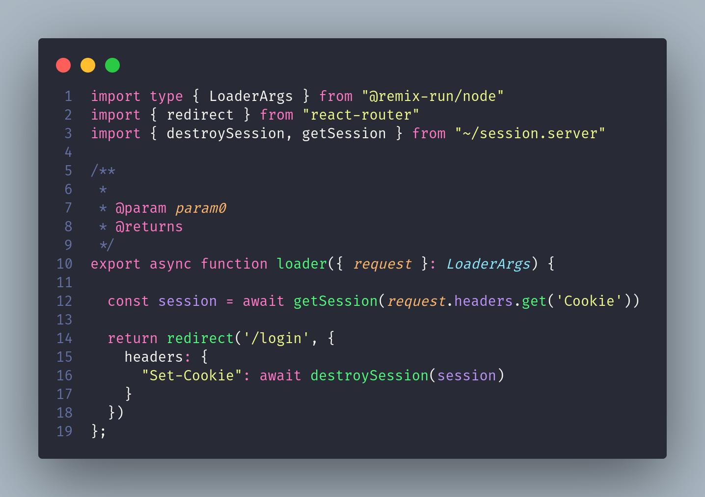

# Autenticação e conteúdo protegido

## Este projeto tem o objetivo de mostrar como realizar autenticação e permitir acesso a conteúdos somente se estiver autenticado

## Libis utilizadas

- https://remix-forms.seasoned.cc/
- https://www.npmjs.com/package/bcryptjs
- https://fakerjs.dev/

## Pegaremos o projeto "06-como-cuidar-da-organizacao-do-projeto" como base para nossa implementação

## 1 - Adicionar uma nova coluna na tabela **"User"**


## 2 - Rodar o comando para alterar o banco de dados

### Como a nova coluna que estamos inserindo não é opcional, o prisma vai dar uma mensagem informando que se ele continuar toda a tabela será removida e criada novamente do zero.

```sh
  npm run db:push
```

## 3 - Vamos instalar uma lib para realizar a criptografia das senhas

```sh
  npm i bcryptjs
  npm i -D @types/bcryptjs
```

## 4 - Agora vamos ajustar o arquivo **"prisma/seed.ts"** para inserir o novo campo "password" definindo uma senha padrão.


### Agora vamos rodar o arquivo **"seed.ts"** para gerar os novos dados em nossa tabela

```sh
  npm db:seed
```

## 5 - Criar o **"auth.api.ts"** dentro da pasta **"app/features/Auth"** que fará o acesso a base de dados para validar os dados do usuário.

#### Ao criar esse arquivo, vamos mover para ele o schema e o type relacionado ao schema removendo-os do arquivo da rota



#### Na rota **"app/routes/login"** vamos chamar função **"login"** criada acima na função **"mutation"**



## 6 - Criação de sessão e proteção de rotas.

### A [documentação](https://remix.run/docs/en/1.14.3/utils/sessions) do Remix propõe a implementação de um arquivo **"session.server.ts"** na pasta **"app"** para tratar a questão de criação/remoção de sessão.

- ### Criar o arquivo **"session.server.ts"**



- ### No arquivo **"app/routes/login.tsx"** na **action** fazer a chamada ao método **createSession** criado acima.



- ### No arquivo **"app/routes/users.tsx"** no **loader** fazer a chamada ao método **getLoggedUser** criado acima para validar se a sessão foi criada.



- ### criar o arquivo **"app/routes/logout.tsx"** para remover a sessão criada


